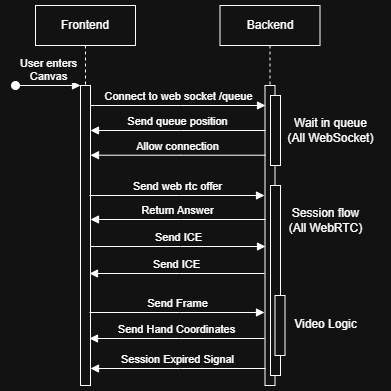
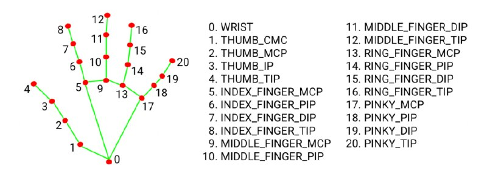
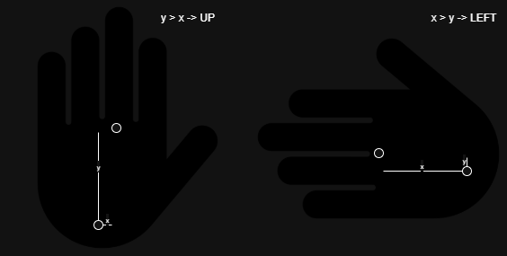

# Finger Drawing

## What this project is about?

This is a study project aimed at improving my software development skills, particularly in real-time communication, computer vision, and system design.

The core idea is to build a drawing tool that allows users to draw using their finger in front of a camera—no physical input device required.

An AI model detects the user’s finger on the screen and continuously tracks its position. These coordinates are then sent to the application, which interprets them as drawing actions (e.g., draw or erase) and renders them in real time.

A key goal of this project is to ensure that the entire system runs on a Raspberry Pi. This constraint adds an extra challenge in terms of performance optimization and efficient resource usage, especially for real-time video processing and communication.

Wanna try? Please use the following link: https://eyextrace.com/

*Note*: I do **NOT** collect any data!

## What is the connection flow?

This diagram illustrates the primary traffic flow of the application, specifically how the Frontend (FE) communicates with the Backend (BE).

### Queue flow

---

When a user connects for the first time, they establish a WebSocket connection to the /queue endpoint. 

During this initial handshake:

- The backend automatically places the user into a waiting queue.
- The user receives their current position in the queue.
- Whenever the queue position changes, the backend pushes an update to the user.

To ensure responsiveness and avoid stale connections, the queue operates with a retry/TTL mechanism:

- The system attempts to notify the next user in line and waits up to 5 seconds for a response.
- If the user does not respond within this time window, the system skips them and proceeds to the next user.

Once a user reaches the front of the queue, they receive a signal that allows them to establish a connection using the WebRTC protocol.

### Session flow

---

After receiving permission to connect:

1. The frontend initiates the WebRTC session by sending an offer to the backend.
2. The backend responds accordingly, and ICE candidates are exchanged to establish the connection.
3. Due to infrastructure limitations, connections are typically routed through a TURN server (e.g., Metered TURN service).

Once the connection is established:

- The frontend begins streaming data (e.g., frames).
- The backend processes this data and sends back relevant updates such as:
    - Coordinates
    - User actions (e.g., draw, erase)

This real-time exchange forms the core functionality of the session.

### Session Termination

---

A session ends under the following conditions:

- The backend detects a WebRTC disconnection, or
- The session reaches its time limit (approximately 1 minute).

Once a session is terminated:

- The backend frees up the slot.
- The next user in the queue is notified and allowed to establish a connection.

## How hand detection for drawing works?

Drawing is the core feature of this application, and it relies on a fairly sophisticated approach to ensure accuracy across different hand orientations—except in the edge case where the finger is pointing directly at the camera.

The system uses an AI model integrated with Google’s MediaPipe framework for hand tracking. This model detects key landmarks of the hand and provides precise positional data for the finger.

## Hand Direction Detection

To correctly interpret finger states, I first needed to determine the orientation of the hand (left, right, up, or down).

This requirement comes from how finger openness is calculated. For example, consider the index finger (landmarks 6, 7, and 8 in the model):

A finger is considered open when:

- Point 7 is greater than point 6
- Point 8 is greater than point 7

If both conditions are satisfied, the finger is open; otherwise, it is considered closed.

At first, this approach worked well. However, an important question came up: what does “greater than” actually mean in this context?

Depending on the orientation of the hand, “greater” could mean:

- Higher on the screen (up)
- More to the left
- More to the right
- Lower on the screen (down)

So the comparison axis is not fixed—it depends on the overall hand direction.

## Determining Hand Direction

To resolve this, I calculate the hand’s orientation using vectors derived from key landmarks. Specifically, I use points 0 (wrist) and 9 (center of the palm) to construct directional vectors.

By analyzing the direction of this vector, I can classify the hand orientation into one of the main directions (up, down, left, right). This allows the system to dynamically decide which coordinate axis to use when comparing finger joints.

As a result, the “greater than” logic becomes consistent regardless of how the user rotates their hand, making finger state detection much more reliable.

A bit intuition about my approach you can gain from the picture below:

It is simplified, for even more insight please check the code Server -> Gestures -> GesturePos.py

*Note*: I'm fully aware that there is an easier way of doing it just calculating **euclidean distance**, but decisions were made and beyond that distance approach turned out to be less effective in certain edge cases. Though it would simplify code a lot.

## Smoothing and Preprocessing Tricks

To improve the overall drawing experience and reduce noise from hand tracking, several small but important techniques are applied.

### Coordinate Smoothing (Adaptive EMA)

---

Raw hand landmark data tends to be jittery, especially when the hand is held still. To address this, I use an adaptive exponential moving average (EMA) to smooth the coordinates.

- Each point is blended with its previous value using a smoothing factor (alpha).
- The smoothing is adaptive:
    - Small movements -> stronger smoothing (reduces jitter)
    - Large movements -> less smoothing (preserves responsiveness)

To detect how much smoothing to apply, I calculate the distance between the previous and current point using Euclidean distance.

If the movement exceeds a small threshold (jump_percent), smoothing is disabled (alpha = 1.0) to avoid lag during fast motion.

This results in:

- Stable lines when drawing slowly
- Immediate response when moving quickly

### Input Cropping (Dead Zones)

---

To avoid unstable tracking near the edges of the camera frame, a preprocessing step removes points that fall within certain boundary regions:

- Left/right margins are slightly cropped
- Top margin is minimally cropped
- Bottom margin is more aggressively cropped (to avoid false detections and awkward angles)

If a point falls inside these “dead zones,” it is ignored.

### Coordinate Normalization

---

After cropping, the remaining input space is rescaled back to a normalized range:

- X and Y values are remapped to [0, 1]
- This ensures consistent drawing behavior regardless of cropping